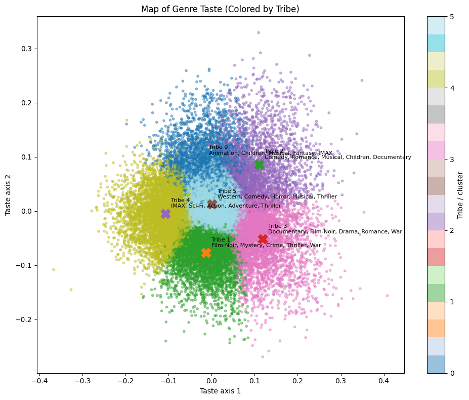

# Beyond Popularity: Taste Tribes, Bridge Movies, and Cold-Start Errors (MovieLens 25M)

**One-line overview:** A data mining project that studies how recommendation methods behave under **sparsity** and **long-tail popularity**, with a focus on **cold-start reasonableness** (over-popular lists, genre mismatch, and long-tail coverage).

👉 **Start here:** `main_notebook.ipynb` (the curated final story notebook). :contentReference[oaicite:1]{index=1}  
🎥 **2-minute project video:** **[[YouTube link here](https://www.youtube.com/watch?v=uv1DfDeKScU)]** 

---

## Why this matters
Recommenders often look good on average metrics but still fail users with **very few interactions** (cold-start). In practice, that can mean:
- generic “blockbuster-only” recommendations,
- recommendations that don’t match a user’s taste region (“genre mismatch”),
- and weak long-tail discovery.

This project aims to **measure and explain** those failure modes, not just report a single accuracy number.

---

## Research questions
1. **RQ1 (Course / Graph Mining):** Do graph-based centrality signals for movies (built from co-rating structure) mostly reproduce popularity?
2. **RQ2 (Course / Similarity Recommendation):** How do popularity vs item–item cosine recommendations perform across user activity groups (cold vs warm users)?
3. **RQ3 (External + Course Comparison / Cold-start Diagnostics):** For users with very few ratings (and movies with few ratings), which method produces more **reasonable** recommendations, and what error types do we observe (over-popular, genre mismatch, low long-tail coverage)?

---

## Results (headline summary)
- MovieLens is **sparse** and **highly long-tailed**: a small fraction of movies receives a large fraction of ratings.
- Item–item similarity improves over a popularity baseline **on average**, but the **coldest users** behave differently (popularity can be competitive when user history is tiny).
- Users form interpretable **taste tribes** in genre-preference space, and the “Taste Map” visualization shows distinct regions of user taste.
- **Bridge movies** (high cross-tribe entropy) highlight items that connect taste regions and can support discovery/onboarding.

> Full analysis, figures, and discussion are in `main_notebook.ipynb`.

---

## Data selection
### Dataset
- **MovieLens 25M** (GroupLens): ~25M ratings, ~62K movies, ~162K users ratings + movie metadata (genres) + tags.
- F. Maxwell Harper and Joseph A. Konstan. 2015. The MovieLens Datasets: History and Context. ACM Transactions on Interactive Intelligent Systems (TiiS) 5, 4: 19:1–19:19. https://doi.org/10.1145/2827872

### How to get the data
The notebooks download the dataset directly from the official GroupLens hosting during execution (so the repo does not need to store the raw dataset).

### Preprocessing (high-level)
Main steps performed inside the notebook:
- Parse timestamps to datetime for leakage-resistant evaluation.
- Time-based train/test split (train = earlier ratings, test = later ratings).
- Feasibility subset for expensive computations (e.g., TOP_N most-rated movies for movie–movie similarity).
- Build user–genre preference vectors for clustering “taste tribes.”

---

## Methods (course vs external)
### Course techniques
- Popularity baseline recommender
- Item–item cosine similarity recommender (user×movie sparse matrix)
- Graph signals / projection-based analysis
- Clustering users in genre-preference space (taste tribes)

## Taste Tribes (Genre Preference Map)

This map visualizes **user taste structure** in MovieLens. Each point is a user, positioned by a 2D projection of their **genre-preference vector** (built from the distribution of genres they rate). Points that are closer together represent users with more similar genre mixes. Colors indicate the discovered **taste tribes (clusters)**, and the labeled centroids summarize each tribe’s most distinctive genres.

**Interpretation:** The presence of distinct colored regions shows that user taste is not one “average” group—there are coherent preference neighborhoods (e.g., blockbuster/spectacle-heavy tastes vs noir/crime/mystery tastes vs family/animation/musical mixtures). Overlap between colors is expected and meaningful: many users are **hybrid/generalist**, sitting between taste regions rather than belonging to a single pure type. This visualization motivates tribe-aware analysis in the notebook (cold-start behavior, genre mismatch errors, and bridge-movie discovery across taste regions).

### External technique
- **Matrix Factorization (MF)** implemented in PyTorch (used because some compiled libraries may be incompatible with Colab’s NumPy/toolchain at runtime).

### Diagnostics (“reasonableness” metrics)
- Over-popular tendency (popularity-driven behavior)
- Genre match to user history / held-out items
- Long-tail coverage

---

## How to reproduce (Colab-first)
This project was developed and run in **Google Colab** (recommended). :contentReference[oaicite:2]{index=2}

### 1) Environment
- Python: **[paste `!python --version` output here]** :contentReference[oaicite:3]{index=3}  
- Install dependencies: see `requirements.txt` (exported from Colab via `pip freeze`). :contentReference[oaicite:4]{index=4}  

### 2) Run order
1. Open and run: **`main_notebook.ipynb`** (Run All).
2. (Optional) Review progression notebooks:
   - `checkpoints/checkpoint_1.ipynb`
   - `checkpoints/checkpoint_2.ipynb` :contentReference[oaicite:5]{index=5}  

### Notes for reproducibility
- The dataset is downloaded inside the notebook.
- Some computations use feasibility limits (e.g., TOP_N) to keep runtime manageable in Colab.

---

## Key dependencies (at-a-glance)
(Full pinned list is in `requirements.txt`.) :contentReference[oaicite:6]{index=6}  

- Python: **[3.12.13]**
- numpy, pandas
- scikit-learn
- scipy
- matplotlib
- networkx
- torch (for MF)

---
